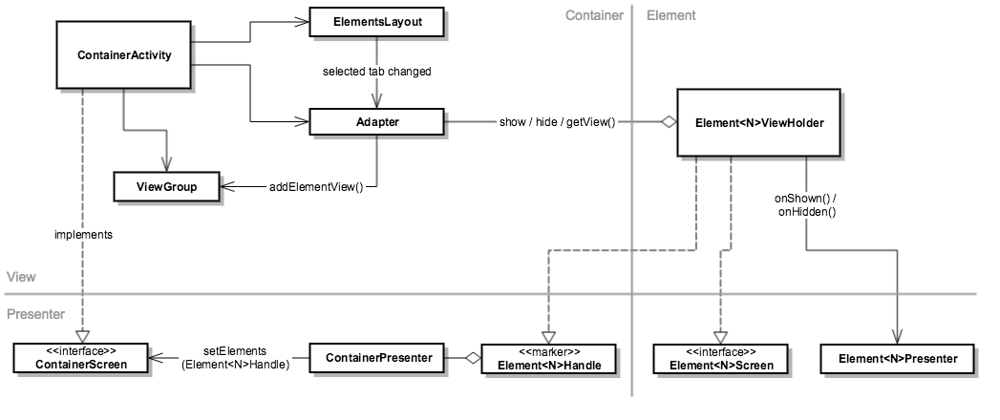

# MVP for Android - Passive View
## Motivation
http://martinfowler.com/eaaDev/PassiveScreen.html
http://codebetter.com/jeremymiller/2007/05/31/build-your-own-cab-part-4-the-passive-view/

## Basic Structure
The main elements of our Passive View implementation in Android are:
* Activity (the view) is the only element that references Android's display objects (Android views, resource IDs, adapters, etc).
* Screen, implemented by the Activity, is the View interface.
* Presenter implements the business logic controlling the view.
* Model is the rest of the application logic.


## Activity
The goal of the Passive View pattern is to minimize the amount of logic implemented in the view (and thus not covered by unit tests), therefore the logic implemented here should be as minimal as possible.  

Guidelines for implementing the activity:
* All events generated by the display should be delegated to the presenter to handle.  These include: create, destroy, stop,  resume, button listener events, text listener events, any widget listener events.  
* Before delegating the create() event to the presenter, finish initializing the activity if needed: inflate the layout, initialize member variables, etc.  The call to the presenter should be the last call in the 
* Any logic which requires branches (if statements, loops, etc) should be delegated to the presenter.
* Encapsulate any display object types with simple java types (interfaces, enums, wrapper classes).
* Keep animation logic in the activity.  
  * Animations have a very wide, builder-style interface that is difficult to wrap with a screen interface.
  * Correctness of animations needs to be verified by visual inspection, which does not lend itself well to unit testing.

## Presenter
* The presenter should only be invoked by the Activity, therefore its only public methods should be event handlers for the view.
* Name event handler methods to describe the event being handled.  E.g.: onScreenCreated(), onButtonAPressed(), onEmailTextEdited(), etc.
* Keep one-to-one mapping between events in the activity and the event handler methods in the presenter. 
* To close the activity, declare finish() method on the screen interface.  It is already implemented by the Activity base class.
* To start another activity.  Declare a navigateTo...() method on the screen and call it.

## Antipatterns
* DO NOT write logic where the activity retrieves data from the presenter:  
```java
public class MyActivity extends Activity implements MyScreen {
  public void onCreate() {
    presenter.onScreenCreated();
    findView(R.id.title_text).setText(presenter.getTitle());
  }
}

public class MyPresenter {
  public String getTitle() {
    if (spring) return "daffodils"
    if (fall) return "leaves"
  }
}
```
Instead DO:
```java
public class MyActivity extends Activity implements MyScreen { 
  public void onCreate() {
    presenter.onScreenCreated();
  }  
    
  @Override 
  public void setText(String title)
    findView(R.id.title_text).setText(title);
  }
}

public class MyPresenter {
  public void onScreenCreated() {
     screen.setTitle(getTitle());
  }
  private String getTitle() {
    if (spring) return "daffodils"
    if (fall) return "leaves"
  }
}
```
In general, public presenter method should not have return values unless handling a display event requries a result to be returned synchronously.

* DO NOT call the same presenter method from multiple places in the activity:
```java
public class MyActivity extends Activity implements MyScreen {
  public void onCreated() {
    findById(R.id.stopButton).addListener(new OnButtonPressed() { 
      public void onPressed() {
        presenter.onStop();
      }
    })
    presenter.onScreenCreated();
  }
  public void onDestroyed() {
    presnter.onStop();
  }
}

public class MyPresenter {
  public void onStop() {
     model.stopDoingStuff();
  }
}
```
Instead DO:
```java
public class MyActivity extends Activity implements MyScreen {
  public void onCreated() {
    findById(R.id.stopButton).addListener(new OnButtonPressed() { 
      public void onPressed() {
        presenter.onStopButtonPressed();
      }
    })
    presenter.onScreenCreated();
  }
  public void onDestroyed() {
    presnter.onScreenDestroyed();
  }
}

public class MyPresenter {
  public void onStopButtonPressed() {
    stop();
  }
  public void onScreenDestroyed() {
    stop();
  }
  
  private void stop() {
    model.stopDoingStuff();
  }
}
```
## Sample
* [Simple My Activity Sample](MyActivity)
 * Solution in lookout_android-passive-view branch
* [Recycler View (copied from googlesamples)](android-RecyclerView)
 * Solution in lookout_android-passive-view branch

## Dagger
An android activity has its own life-cycle and can have multiple instances residing in memory at the same time, therefore the MVP elments created and managed by Dagger for the activity require their own graph of objects in (sub-component or a dependent component). 


To achieve the above graph of objects, we use a sub-component, which is created by calling a `newMyActivitySubcomponent()` method on the application component.  This method will call a new instance of the graph every time it's called, and it requires a reference to the creating `MyActivity` in order to seed the graph.  The `MyUiComponent` interface helps encapsulate the UI layer of the application.


## Containers
Activities that contain other views, such as fragments, lists with adapters, tabbed views), are a particualr challange for MVP.  If a contained view dynamically is dynamically allocated/inflated, then it's probably complex enough to have its own presenter.  The tricky part is allowing the presenter to implement the business logic of deciding what view should be created when, when only the activity has access to the necessary display resources to instantiate the child view and add it to the display.



* Use a view holder or some other wrapper to create and manage the android view objects that are added to the display dynamically.
* The view holder has its own presenter, which should be created on demand at the time when the android view object is created.
* The presenter for the container view should be responsible for decising which and how many contained elements there are.
 * It needs to have a way to create the view holers for the elements.  This could be using a factory method on the container screen interface, or injected using dagger, etc.
 * The container presenter needs a way to refer to the element's view holder.  This could be an enum, which is then mapped by the container activity to the view holder, or it could be a [marker interface](https://en.wikipedia.org/wiki/Marker_interface_pattern) on the view holder, or some other form of handle.
* The container presenter should not reference element's presenter directly.  Element's presenter is a contract between the element view holder and the application model only.

